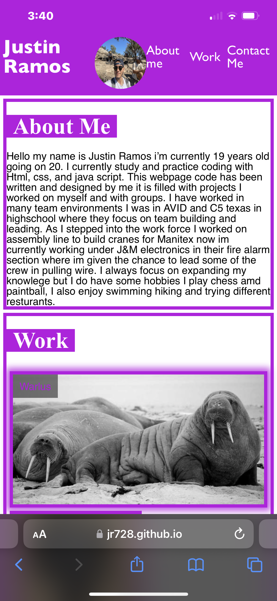
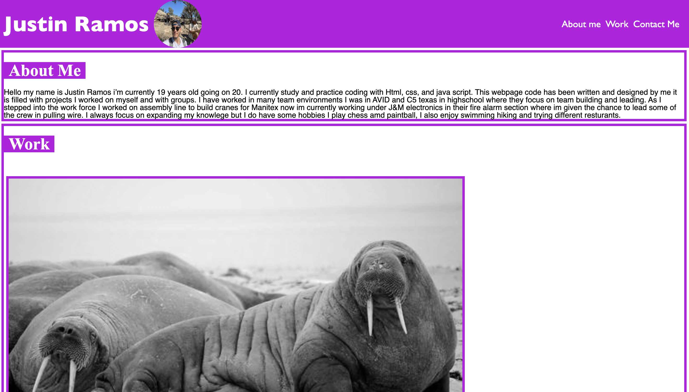

# digital-dossier
Website with my own portfolio of code I designed myself and soon to be for career
## Description
This web page is a portfolio where multiple web pages are stored. The web page hold images of web applications that have been worked on by the coder. Its to make it eaiser for the employer to see work.
## Usages
An employer can look through projects I have made while for the creator I can add new projects that will be made and store them all. Link: https://jr728.github.io/digital-dossier/
## Images

## License
MIT